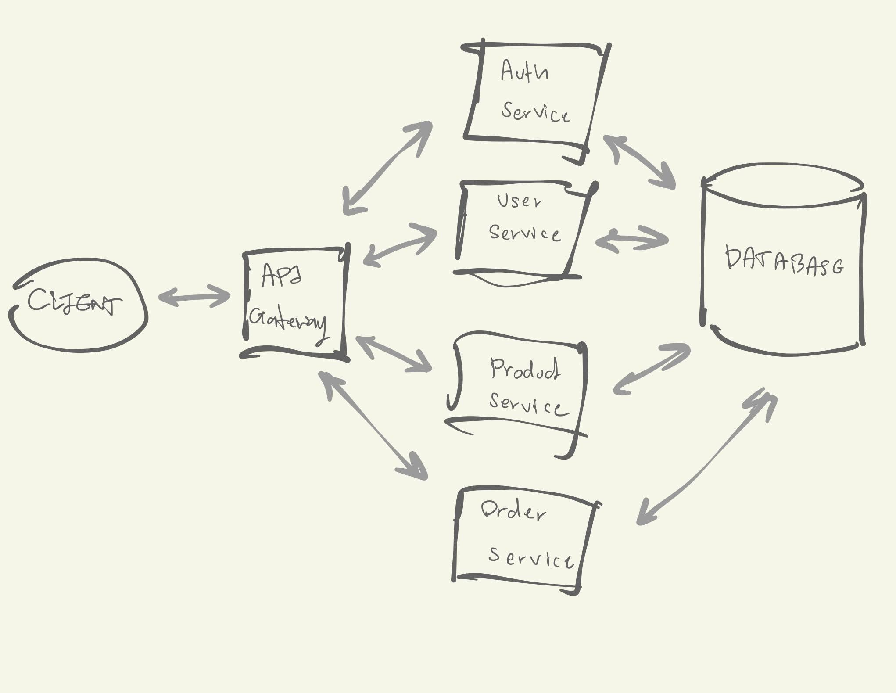

## Architecture 



## Database Diagram


## Tech Stack

* [NestJS](https://github.com/nestjs/nest)
* [TypeORM](https://github.com/nestjs/nest)
* [Postgresql](https://www.postgresql.org)

## To see the document.

Click [here](https://documenter.getpostman.com/view/24530284/2s8YzMYRSo#c26ba591-5a0d-4b58-a279-88a91a65279c) or import a file named neversitup-test.postman_collection.json in this directory to postman.

## To run the project

Ensure that you have docker installed and run the below script.

```bash
$ docker-compose up --build -d
```

The application should be running on port 3000 as it is set in docker-compose.yml, And you can follow the below script for checking it is working.

```bash
$ curl -X http://localhost:3000
Hello World!!!
```


